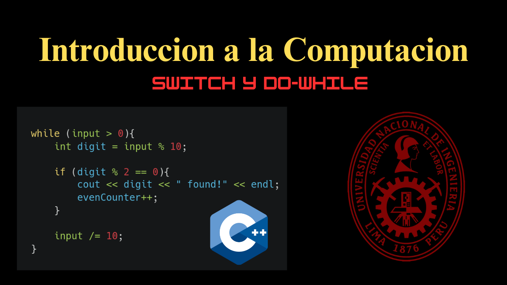
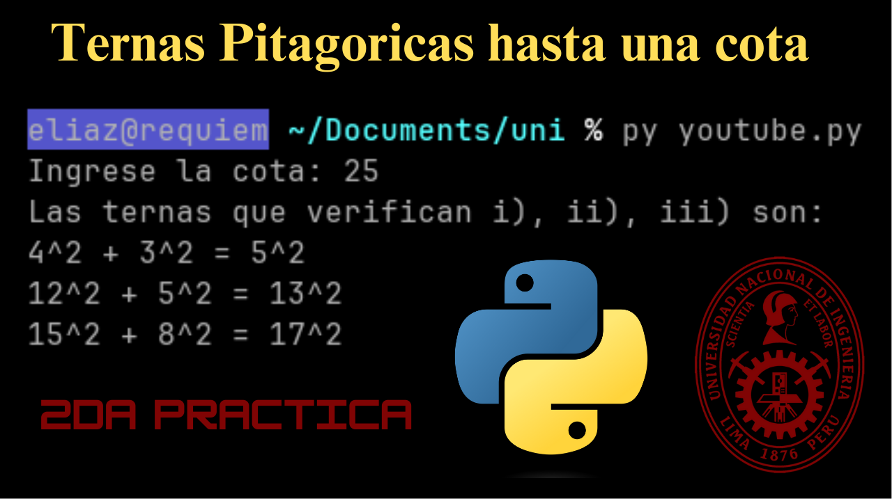

## Tutoriales

### [Budget Calc & Pair Digits](https://youtu.be/rROFjNwzvc4?feature=shared)

Resolucion de dos problmeas de una quinta dirigida.

### [Ternas Pitagoricas]()

Resolucion de un problema de 2da PC en Python.

## Planchas

[Drive FC](https://unipe-my.sharepoint.com/personal/nick_zegarra_c_uni_pe/_layouts/15/onedrive.aspx?id=%2Fpersonal%2Fnick%5Fzegarra%5Fc%5Funi%5Fpe%2FDocuments%2FONEDRIVEFC%2DUNI%2FCURSOS%20FC%2FBIC01%20%2D%20Introducci%C3%B3n%20a%20la%20Computaci%C3%B3n%2FPr%C3%A1cticas%20y%20Ex%C3%A1menes%20Pasados)
